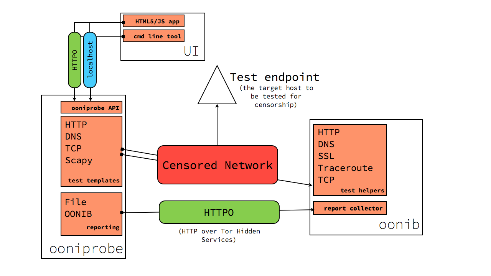

Architecture
============

The goal of this document is provide an overview of how ooni works, what are
it's pieces and how they interact with one another.

Keep in mind that this is the *big picture* and not all of the features and
compontent detailed here are implemented.
To get an idea of what is implemented and with what sort of quality see the
`Implementation status`_ section of this page.

The two main components of ooni are `oonib`_ and `ooniprobe`_.

ooniprobe
---------

ooniprobe the client side component of ooni that is responsible for performing
measurements on the to be tested network.

The main design goals for ooniprobe are:

Test specification decoupling
.............................

By this I mean that the definition of the test should be as loosely coupled to
the code that is used for running the test.

This is achieved via what are called **Test Templates**. Test Templates a high
level interface to the test developer specific to the protocol they are writing
a test for.
The Test template will then be responsible for implementing the measurement
logic, generic error handling and the formatting of reports using a format that
is standard for the type of test that is being run.

This does not mean that test developers should only include in their report
tests what is generated for them by the test template, but, when using Test
Templates, the report will always be a superset of what is provided by the test
template.

For example the a test based on the :class:`ooni.templates.httpt.HTTPTest` test
template will always have the list of HTTP requests performed and the responses
received, but a developer may with to include inside of their report the
checksum of the of the content as is show in the example in `Writing Tests
<writing_tests.html>`_.

Support for high concurrency
............................

By this I mean that we want to be able to scan through big lists as fast as
possible.

The problem when doing censorship measurement tests is that you often have to
deal with very big lists and going over these lists sequentially is slow and
time consuming.

For this purpose we have chosen to use the `Twisted networking framework
<http://twistedmatrix.org>`_. The reasons for using Twisted are:

  * It is stable and has been around for many year (version 1.0 came out 11 years XXX citation)

  * People in the Tor community use it

  * People in the Python community use it

If you have an argument for which you believe Twisted is not a good idea, I
would love to know :).

Notes:
.. XXX

Running lot's of tests concurrently can reduce their accuracy.  The strategy
for dealing with this involves doing proper error handling and adjusting the
concurrency window over time if the amount of error rates increases.

Currently the level of concurrency for tests is implemented inside of
:class:`ooni.inputunit`_, but we do not expose to the user a way of setting
this. Such feature will be something that will be controllable via the
ooniprobe API.

Why Tor Hidden Services?
........................

We chose to use Tor Hidden Services as the means of exposing a backend
reporting system for the following reasons:

Easy addressing
_______________

Using Tor Hidden Service allows us to have a globally unique identifier to be
passed to the ooni-probe clients. This identifier does not need to change even
if we decide to migrate the collector backend to a different machine (all we
have to do is copy the private key to the new box).

It also allows people to run a collector backend if they do not have a public
IP address (if they are behing NAT for example).

Security
________

Tor Hidden Services give us for free and with little thought end to end
encryption and authentication. Once the address for the collector has been
transmitted to the probe you do not need to do any extra authenticatication, because
the address is self authenticating.

Possible drawbacks
__________________

Supporting Tor Hidden Services as the only system for reporting means a
ooni-probe user is required to have Tor working to be able to submit reports to
a collector. In some cases this is not possible, because the user is in a
country where Tor is censored and they do not have any Tor bridges available.

Latency is also a big issue in Tor Hidden Services and this can make the
reporting process very long especially if the users network is not very good.

For these reasons we plan to support in the future also non Tor HS based
reporting to oonib. 
Currently this can easily be achieved by simply using tor2web.org.

Standardization
...............

.. TODO

oonib
-----

This is the backend component of OONI. It is responsible for exposing `test
helpers`_ and the `report collector`_.

Test Helpers
............

Test helpers implement server side protocols that are of assistance to
ooniprobes when running tests.

If you would like to see a test helper implemented inside of oonib, thats
great!
All you have to do is `open a ticket on trac
<https://trac.torproject.org/projects/tor/newticket?component=Ooni&keywords=oonib_testhelpers%20ooni_wishlist&summary=Add%20support%20for%20PROTOCOL_NAME%20test%20helper>`_.

To get an idea of the current implementation status of test helpers see the
`oonib/testhelpers/
<https://gitweb.torproject.org/ooni-probe.git/tree/HEAD:/oonib/testhelpers>`_
directory of the ooniprobe git repository.

.. TODO
   write up the list of currently implemented test helpers and how to use them.

Report collector
................

.. autoclass:: oonib.report.file_collector.NewReportHandlerFile
    :noindex:

An ooniprobe run
----------------

Here we describe how an ooniprobe run should look like:

  1. If configured to do so ooniprobe will start a connection to the Tor
       network for the purpose of having a known good test channel and for
       having a way of reporting to the backend collector

  2. It will obtain it's IP Address from Tor via the getinfo addr Tor Ctrl port
       request.

  3. If a collect is specified it will connect to the reporting system and get
       a report id that allows them to submit reports to the collector.

  4. If inputs are specified it will slice them up into chunks of request to be
       performed in parallel.

  5. Once every chunk of inputs (called an InputUnit) will have completed the
       report file and/or the collector will be updated.

ooniprobe API
-------------

Note: This is currently not under active development, but we are looking for
people interested in hacking on it!

The goals of the ooniprobe API is that of allowing applications to interact
with an ooniprobe.

Such API will be exposed as an HTTP service that communicates with applications
thanks to JSON formatted messages.

When ooniprobe is launched it will start as a daemon. Through the HTTP based
API it will be possible to `start tests`_, `stop tests`_ and `monitor test
progress`_.

By having it use HTTP it will be possible to decouple the problem of running
tests from that of controlling them.
You can think of it as the Tor Control port of ooniprobe.

The kinds of clients that will be interested in using such API are:

  * The ooniprobe *command line interface*

  * The ooniprobe *HTML5/JS web application*

  * Any *third party* tool that is interested in running ooniprobe tests with
    custom arguments.

Towards a RPC like interface
----------------------------

Such API will allow ooniprobes to expose such API as a Tor Hidden
Service (if the user wishes to do so). This will allow people running ooniprobe
to give the .onion address of the probe to a censorship researcher and they
will then be able to run tests from the network vantage point of the probe.

Draft API specification
------------------------

Through the ooniprobe API it will be possible to `start tests`_, `stop tests`_ and `monitor test
progress`_.

List tests
..........

`GET /test`

Shall return the list of available tests as an array.

This is how a response looks like
::

  [{'id': 'http_requests',
    'name': 'HTTP Requests Test',
    'description': 'This test perform a HTTP GET request for the / resource over the test network and over Tor',
    'type': [ 'blocking' ],
    'version': '0.1',
    'arguments': {
      'urllist': 'Specify the list of URLs to be used for the test'
    }
  }]

*type* may be either **blocking** or **manipulation**.

Start tests
...........

`POST /test/<test_id>/start`

Is used to start a test with the specified test_id.

Inside of the request you will specify the arguments supported by the test

This is how a request could look like
::
  {
    'urllist':
      ['http://google.com/', 'http://torproject.org/']
  }

The server will then respond with the test object
::
  {
    'status': 'running',
    'percentage': 0,
    'current_input': 'http://google.com/',
    'urllist':
      ['http://google.com/', 'http://torproject.org/']
  }

Stop tests
...........

`POST /test/<test_id>/stop`

This will terminate the execution of the test with the specified test_id.

The request may optionally contain a reason for stopping the test such as
::
  {
    'reason': 'some reason'
  }

Monitor test progress
.....................

`GET /test/<test_id>`

Will return the status of a test

Like so for example
::
  {
    'status': 'running',
    'percentage': 0,
    'current_input': 'http://google.com/',
    'urllist':
      ['http://google.com/', 'http://torproject.org/']
  }

Implementation status
---------------------

ooniprobe
.........

**Reporting**

  * To flat YAML file: *alpha*

  * To remote httpo backend: *alpha*

**Test templates**

  * HTTP test template: *alpha*

  * Scapy test template: *alpha*

  * DNS test template: *alpha*

  * TCP test template: *prototype*

**Tests**

To see the list of implemented tests see:
https://ooni.torproject.org/docs/#core-ooniprobe-tests

**ooniprobe API**

  * Specification: *draft*

  * HTTP API: *not implemented*

**ooniprobe HTML5/JS user interface**

  Not implemented.

**ooniprobe build system**

  Not implemented.

**ooniprobe command line interface**

  Implemented in alpha quality, though needs to be ported to use the HTTP based
  API.

oonib
.....

**Collector**

  * collection of YAML reports to flat file: *alpha*

  * collection of pcap reports: *not implemented*

  * association of reports with test helpers: *not implemented*

**Test helpers**

  * HTTP Return JSON Helper: *alpha*

  * DNS Test helper: *prototype*

  * Test Helper - collector mapping: *Not implemented*

  * TCP Test helper: *prototype*

  * Daphn3 Test helper: *prototype*

